# Week 2 Lecture Transcript: Pydantic for LLM Workflows

> **Instructor script** — walkthrough of `lesson_2` through `lesson_5`, plus the capstone `project.ipynb`.  
> **Running example:** a customer support system that validates user input, extracts structured LLM output, retries on failure, and calls tools to build support tickets.

---

## Table of Contents

1. [Course arc & learning goals](#1-course-arc--learning-goals)
2. [Lesson 2 — Pydantic basics](#2-lesson-2--pydantic-basics)
3. [Lesson 3 — Prompting, validation & retry](#3-lesson-3--prompting-validation--retry)
4. [Lesson 4 — Native structured output](#4-lesson-4--native-structured-output)
5. [Lesson 5 — Tool calling & full pipeline](#5-lesson-5--tool-calling--full-pipeline)
6. [Capstone project](#6-capstone-project)
7. [Instructor cheat sheet](#7-instructor-cheat-sheet)

---

## 1. Course arc & learning goals

### Opening (say this)

> "This week, Pydantic is not just a validation library — it becomes the **contract** between your app, your LLM, and your tools. We start with a simple `UserInput` model, grow it into a `CustomerQuery` analysis, then wire it into Gemini for structured output and function calling. By the end, one schema family drives validation everywhere."

### What students should leave with

| Lesson | Notebook | Core skill |
|--------|----------|------------|
| 2 | `lesson_2.ipynb` | Define models, catch `ValidationError`, use `Field` constraints |
| 3 | `lesson_3.ipynb` | Prompt for JSON, validate LLM output, build a retry loop |
| 4 | `lesson_4.ipynb` | Pass schema to Gemini / Pydantic AI — skip manual retries |
| 5 | `lesson_5.ipynb` | Tool schemas from models, execute tools, emit `SupportTicket` |
| Project | `project.ipynb` | Build your own LLM output validator end-to-end |

### Week 2 architecture (show this diagram)

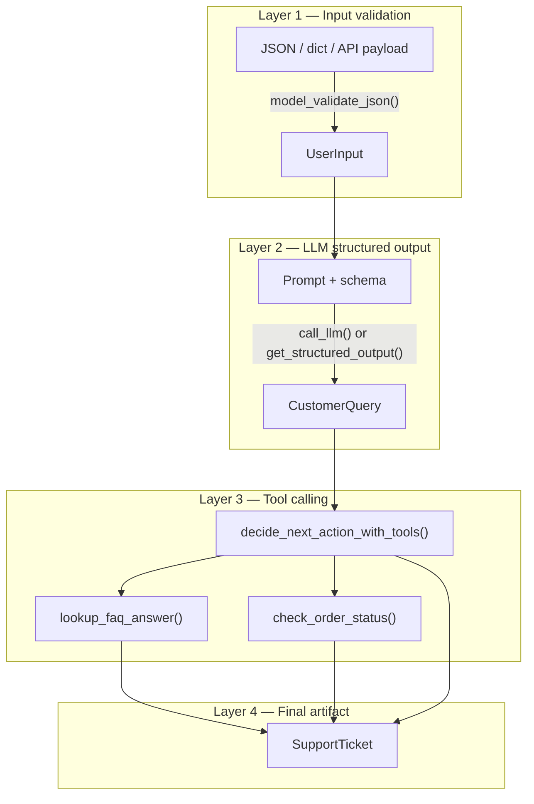

### Model inheritance (show this diagram)

All lessons reuse and extend the same domain models:

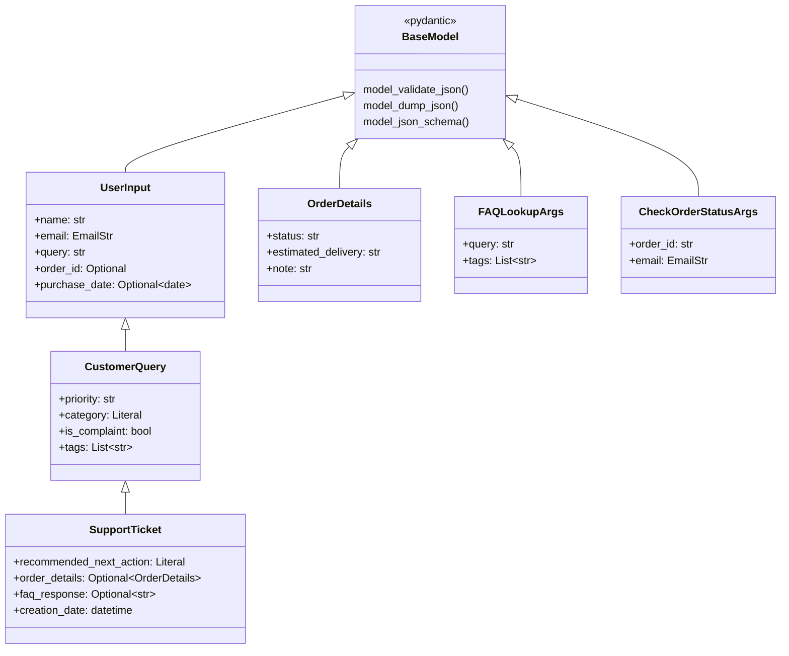

**Teaching point:** inheritance means the LLM must echo back user fields *and* add analysis fields — one object, one validation pass.

---

## 2. Lesson 2 — Pydantic basics

**Notebook:** `lesson_2.ipynb`  
**Theme:** "Garbage in never becomes garbage out."

### 2.1 Why Pydantic?

> "Python is dynamically typed. APIs, forms, and LLMs send you dicts and JSON strings. Pydantic turns those into **typed Python objects** and rejects bad data before your business logic runs."

### 2.2 First model: `UserInput`

```python
class UserInput(BaseModel):
    name: str
    email: EmailStr
    query: str
```

**Live demo talking points:**

1. Instantiate with keyword args — Pydantic coerces when safe.
2. Pass invalid email (`"not-an-email"`) — show the raw `ValidationError` traceback.
3. Emphasize: validation happens at **construction time**, not later.

### 2.3 Validation flow (show this diagram)

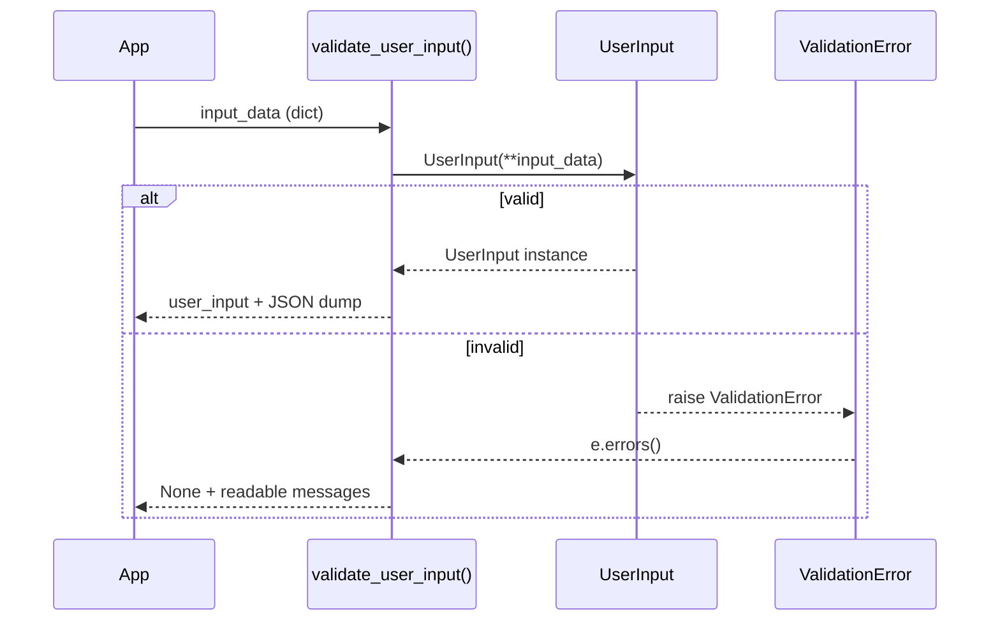

**Function linkage:**

| Function | Calls | Returns |
|----------|-------|---------|
| `validate_user_input(input_data)` | `UserInput(**input_data)` | `UserInput` or `None` |
| `UserInput.model_dump_json()` | — | JSON string for logging/API |

### 2.4 Error handling pattern

```python
def validate_user_input(input_data):
    try:
        user_input = UserInput(**input_data)
        print(user_input.model_dump_json(indent=2))
        return user_input
    except ValidationError as e:
        for error in e.errors():
            print(f"  - {error['loc'][0]}: {error['msg']}")
        return None
```

> "Notice we iterate `e.errors()` — each item has `loc` (field path) and `msg`. This pattern reappears in Lesson 3 when the *LLM* is the one sending bad data."

### 2.5 Optional fields & `Field` constraints

```python
class UserInput(BaseModel):
    name: str
    email: EmailStr
    query: str
    order_id: Optional[int] = Field(None, ge=10000, le=99999)
    purchase_date: Optional[date] = None
```

**Demo sequence (do in order):**

| Input tweak | What happens | Lesson |
|-------------|--------------|--------|
| Missing `query` | Required field error | Required vs optional |
| Extra keys (`system_message`, `iteration`) | Ignored by default | Pydantic strips unknown fields |
| `"2025-12-31"` string for date | Coerced to `date` | Smart coercion |
| `"12345"` string for `order_id` | Coerced to `int` | Coercion |
| `name: 99999` | Coerced to `"99999"` | Strings accept ints |
| `order_id: "01234"` | Fails `ge=10000` | Constraints still apply after coercion |

### 2.6 JSON entry points

Two paths — highlight both:

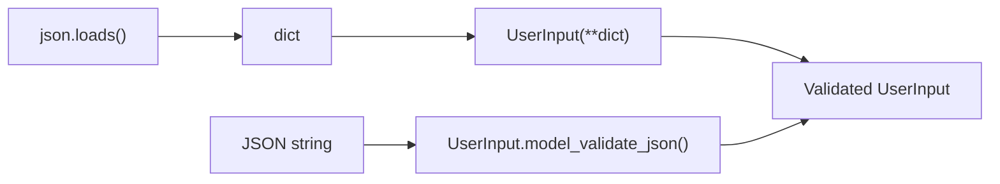

> "`model_validate_json` is the one-liner you'll use when data arrives as a string from an HTTP body or an LLM."

### 2.7 Lesson 2 wrap-up (say this)

> "You now have a reusable input gate. Everything in Week 2 builds on this: same fields, stricter models, then LLMs and tools that must respect the same contract."

---

## 3. Lesson 3 — Prompting, validation & retry

**Notebook:** `lesson_3.ipynb`  
**Theme:** "The LLM is an untrusted data source — treat its output like user input."

### 3.1 Extending the model: `CustomerQuery`

```python
class CustomerQuery(UserInput):
    priority: str = Field(..., description="Priority level: low, medium, high")
    category: Literal['refund_request', 'information_request', 'other']
    is_complaint: bool
    tags: List[str]
```

> "`CustomerQuery` **inherits** `UserInput`. The LLM must return the original user fields plus analysis fields. One model, one validation."

### 3.2 Prompt → LLM → validate pipeline

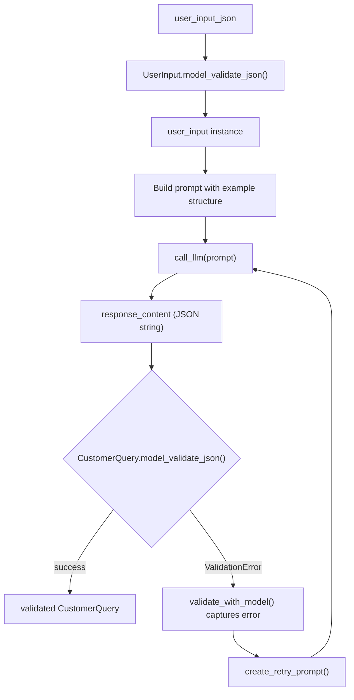

### 3.3 Function linkage map

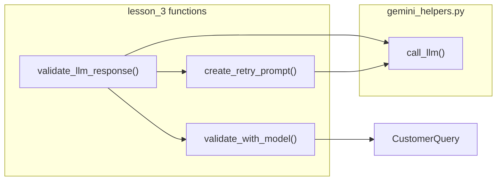

| Function | Responsibility |
|----------|----------------|
| `call_llm(prompt)` | Raw text from Gemini |
| `validate_with_model(data_model, llm_response)` | Parse + validate; return `(instance, None)` or `(None, error_msg)` |
| `create_retry_prompt(original, response, error)` | Feedback prompt with XML-tagged context |
| `validate_llm_response(prompt, data_model, n_retry=5)` | Orchestrates the full retry loop |

### 3.4 The deliberate failure (important demo)

Run `CustomerQuery.model_validate_json(response_content)` after the first LLM call.

Expected failure:

```
category: Input should be 'refund_request', 'information_request' or 'other'
  (got 'account_access')
```

> "The model invented a category outside our `Literal`. **This is why we validate.** Without `Literal`, bad enums silently enter your database."

### 3.5 Retry prompt structure

Walk through the three XML blocks in `create_retry_prompt`:

1. `<original_prompt>` — what we asked
2. `<llm_response>` — what we got
3. `<error_message>` — what Pydantic rejected

> "You're teaching the model to self-correct using the same error messages you'd show a human developer."

### 3.6 Retry loop internals

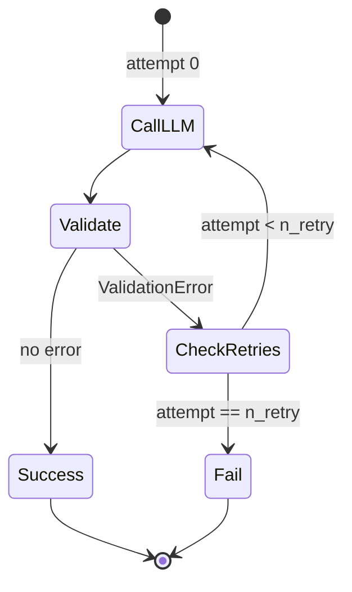

Core loop (simplified):

```python
def validate_llm_response(prompt, data_model, n_retry=5, model=DEFAULT_MODEL):
    response_content = call_llm(prompt, model=model)
    current_prompt = prompt
    for attempt in range(n_retry + 1):
        validated_data, validation_error = validate_with_model(data_model, response_content)
        if not validation_error:
            return validated_data, None
        if attempt < n_retry:
            current_prompt = create_retry_prompt(current_prompt, response_content, validation_error)
            response_content = call_llm(current_prompt, model=model)
    return None, f"Max retries reached..."
```

### 3.7 JSON Schema as prompt (upgrade)

```python
data_model_schema = json.dumps(CustomerQuery.model_json_schema(), indent=2)
prompt = f"... Return JSON matching this schema:\n{data_model_schema}"
```

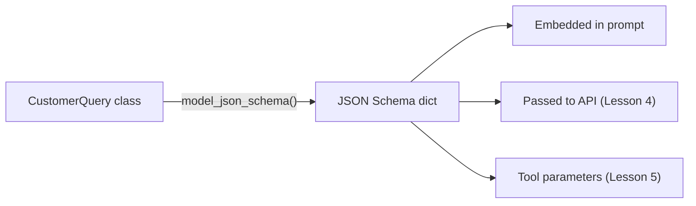

> "The schema is the single source of truth. You define it once in Python; it drives prompts, API config, and tool declarations."

### 3.8 Lesson 3 wrap-up (say this)

> "You built what frameworks do internally: generate, validate, retry with feedback. Lesson 4 asks: what if the API enforces the schema for us?"

---

## 4. Lesson 4 — Native structured output

**Notebook:** `lesson_4.ipynb`  
**Theme:** "Push validation left — into the API call."

### 4.1 Compare approaches (show this diagram)

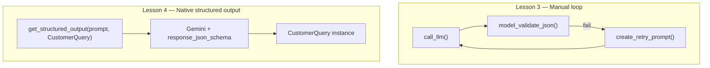

### 4.2 `gemini_helpers.py` — the bridge

```python
def get_structured_output(prompt, response_model, model=DEFAULT_MODEL, ...):
    response = _get_client().models.generate_content(
        model=model,
        contents=prompt,
        config=types.GenerateContentConfig(
            response_mime_type="application/json",
            response_json_schema=response_model.model_json_schema(),
        ),
    )
    return response_model.model_validate_json(response.text)
```

**Linkage:**

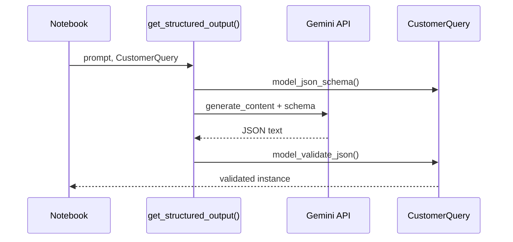

### 4.3 Two helper variants

| Function | Returns | Use when |
|----------|---------|----------|
| `get_structured_output()` | `CustomerQuery` instance | You want typed object immediately |
| `get_structured_output_json()` | `(json_str, raw_response)` | You need to inspect Gemini metadata |

### 4.4 Pydantic AI agent

```python
from pydantic_ai import Agent

agent = Agent(
    model="google:gemini-3.1-flash-lite",
    output_type=CustomerQuery,
)
response = agent.run_sync(prompt)
print(response.output)  # CustomerQuery instance
```

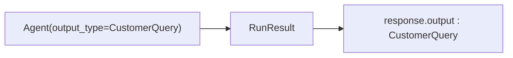

> "Pydantic AI wraps model selection, structured output, and retries. Under the hood it's the same idea: **output_type is a Pydantic model**."

### 4.5 Fun inspection moment

`GenerateContentResponse` inherits from Pydantic's `BaseModel`:

```
google.genai.types.GenerateContentResponse
  → google.genai._common.BaseModel
  → pydantic.main.BaseModel
```

> "Even Google's SDK speaks Pydantic. The ecosystem converges on the same pattern."

### 4.6 Lesson 4 wrap-up (say this)

> "When the API accepts your schema, prefer native structured output. Keep Lesson 3's retry pattern in your toolkit for models or providers that don't — or when you need custom feedback prompts."

---

## 5. Lesson 5 — Tool calling & full pipeline

**Notebook:** `lesson_5.ipynb`  
**Theme:** "Models define not only *what you store* but *what the LLM can invoke*."

### 5.1 Model evolution in Lesson 5

Lesson 5 tightens `order_id` with a custom validator:

```python
@field_validator("order_id")
def validate_order_id(cls, order_id):
    pattern = r"^[A-Z]{3}-\d{5}$"
    ...
```

> "Same field name as Lesson 2, different business rule — schemas evolve with your domain. Call out that `order_id` changed from `int` to `str` with regex validation."

### 5.2 Tool argument models

```python
class FAQLookupArgs(BaseModel):
    query: str
    tags: List[str]

class CheckOrderStatusArgs(BaseModel):
    order_id: str
    email: EmailStr
```

Tool registration:

```python
tool_definitions = [{
    "type": "function",
    "function": {
        "name": "lookup_faq_answer",
        "parameters": FAQLookupArgs.model_json_schema()
    }
}, ...]
```

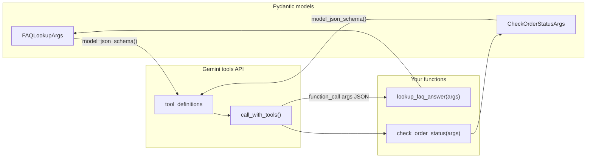

### 5.3 Full support ticket pipeline

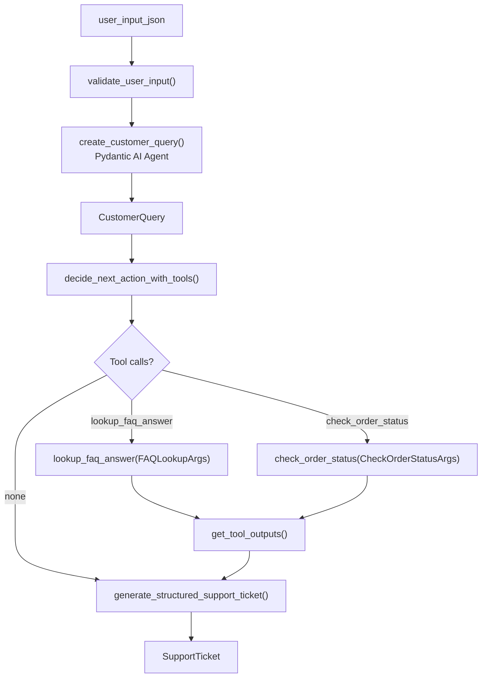

### 5.4 Function reference (end-to-end)

| Step | Function | Input → Output |
|------|----------|----------------|
| 1 | `validate_user_input(user_json)` | `str` → `UserInput` |
| 2 | `create_customer_query(valid_user_json)` | `str` → `CustomerQuery` via Pydantic AI |
| 3 | `decide_next_action_with_tools(customer_query)` | `CustomerQuery` → `(message, tool_calls, messages)` |
| 4 | `get_tool_outputs(tool_calls)` | tool calls → `[{tool_call_id, output}]` |
| 5 | `generate_structured_support_ticket(...)` | query + tool results → `SupportTicket` |

### 5.5 Tool execution flow (sequence diagram)

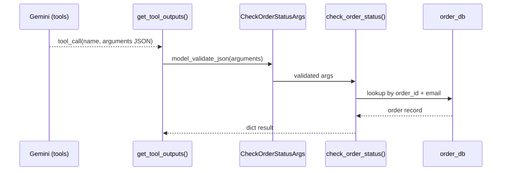

> "Always validate tool arguments with the same Pydantic model you used to **declare** the tool. The LLM is still an untrusted caller."

### 5.6 `SupportTicket` — composed output

```python
class SupportTicket(CustomerQuery):
    recommended_next_action: Literal['escalate_to_agent', 'send_faq_response', ...]
    order_details: Optional[OrderDetails] = None
    faq_response: Optional[str] = None
    creation_date: datetime
```

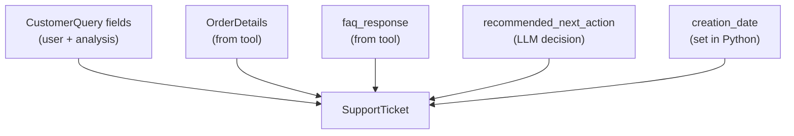

### 5.7 Live demo narrative (headphones order)

1. User asks about delivery → `information_request`
2. LLM calls `check_order_status` with `ABC-12345`
3. Tool returns `shipped`, delivery `2025-12-05`
4. `get_structured_output` builds ticket → `send_order_status`

**Second demo (unhappy customer, wrong email on order):**

- Tool note: `"order_id found but email mismatch"`
- Ticket → `escalate_to_agent`, `priority: high`

> "Tools give the LLM **ground truth**. Pydantic ensures the final ticket shape is still predictable."

### 5.8 Lesson 5 wrap-up (say this)

> "One week, one domain, four layers: validate input, structure LLM output, call tools with validated args, emit a rich typed artifact. That's production-shaped AI application design."

---

## 6. Capstone project

**Notebook:** `project.ipynb`

### Prompt to students

> "Build an LLM output validator for a domain you choose. Your `BaseModel` must include typed fields, `Field()` constraints, `Optional` fields, and `Literal` choices. Attach `project.ipynb` and `docs.md` when using the Jupyter AI chatbot."

### Minimum viable architecture (reference)

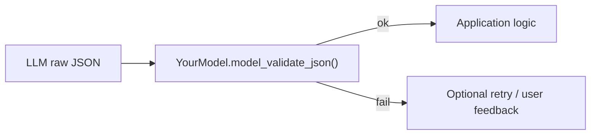

### Grading rubric talking points

- Model inherits from `BaseModel` with meaningful constraints
- Validation errors are handled gracefully (not uncaught tracebacks)
- Schema is reused (dumped to prompt or API) — not duplicated by hand
- Bonus: tool calling or structured output via `gemini_helpers`

---

## 7. Instructor cheat sheet

### Key Pydantic methods (repeat until automatic)

| Method | Purpose |
|--------|---------|
| `Model(**dict)` | Construct from Python dict |
| `Model.model_validate_json(str)` | Parse JSON string + validate |
| `instance.model_dump()` | To dict |
| `instance.model_dump_json()` | To JSON string |
| `Model.model_json_schema()` | JSON Schema for prompts/APIs/tools |

### Common student mistakes

| Mistake | Fix |
|---------|-----|
| `EmailStr` ImportError | `pip install pydantic[email]` or `email-validator` |
| LLM returns markdown fences around JSON | Strip fences or use native structured output |
| `Literal` too strict for LLM | Retry loop or widen enum + post-process |
| Mismatch `order_number` vs `order_id` in JSON | Extra keys ignored; required fields still missing |
| Forgetting to validate tool args | Always `ArgsModel.model_validate_json(tool_call.arguments)` |

### Suggested live-coding order

1. `lesson_2` — break email, fix with `validate_user_input`
2. `lesson_3` — show `category` Literal failure → single retry success
3. `lesson_4` — same prompt, `get_structured_output` in one call
4. `lesson_5` — run full pipeline cell, inspect tool call JSON

### Time guide (~90 min lecture)

| Segment | Minutes | Notebook |
|---------|---------|----------|
| Intro + model inheritance | 10 | — |
| Pydantic basics | 20 | `lesson_2` |
| Retry loop | 25 | `lesson_3` |
| Native structured output | 15 | `lesson_4` |
| Tool calling pipeline | 15 | `lesson_5` |
| Q&A + project intro | 5 | `project` |

---

## Closing (say this)

> "Pydantic gives you a **single source of truth**: Python classes that validate user input, constrain LLM output, declare tool parameters, and serialize to JSON Schema. Start strict, handle errors explicitly, and let the schema travel with your data from the HTTP boundary to the model boundary to your database."

---

*Generated for Week 2 — SUT AI Software Development. Source notebooks: `lesson_2.ipynb`–`lesson_5.ipynb`, `gemini_helpers.py`, `project.ipynb`.*
