# Week 3 Lecture Transcript: Agentic RAG with LlamaIndex

> **Instructor script** — walkthrough of `L1` through `L4`.  
> **Running example:** research Q&A over academic PDFs (MetaGPT → multi-paper ICLR corpus), where the LLM chooses *how* to retrieve — not just *what* to retrieve.  
> **Stack:** LlamaIndex + Gemini (`GoogleGenAI`) + local embeddings (`BAAI/bge-small-en-v1.5`).

---

## Table of Contents

1. [Course arc & learning goals](#1-course-arc--learning-goals)
2. [Shared infrastructure](#2-shared-infrastructure)
3. [Lesson 1 — Router Engine](#3-lesson-1--router-engine)
4. [Lesson 2 — Tool Calling](#4-lesson-2--tool-calling)
5. [Lesson 3 — Agent Reasoning Loop](#5-lesson-3--agent-reasoning-loop)
6. [Lesson 4 — Multi-Document Agent](#6-lesson-4--multi-document-agent)
7. [Instructor cheat sheet](#7-instructor-cheat-sheet)

---

## 1. Course arc & learning goals

### Opening (say this)

> "Last week we taught the LLM to speak in structured schemas. This week we teach it to **choose retrieval strategies**. Naive RAG always embeds the query and returns top-k chunks. Real research questions need summarization *or* fact lookup *or* page-scoped search *or* multi-hop tool use across papers. By the end of this week, one agent can route, call tools with arguments, reason in a loop, and retrieve the right tools at scale."

### What students should leave with

| Lesson | Notebook | Core skill |
|--------|----------|------------|
| 1 | `L1_Router_Engine.ipynb` | Same nodes → two indexes → `RouterQueryEngine` picks one |
| 2 | `L2_Tool_Calling.ipynb` | `predict_and_call`: pick tool **and** fill args (page filters) |
| 3 | `L3_Building_an_Agent_Reasoning_Loop.ipynb` | `FunctionAgent` + `Context`: multi-step research |
| 4 | `L4_Building_a_Multi-Document_Agent.ipynb` | Many papers; `ObjectIndex` tool retrieval when tools explode |

### Conceptual progression (show this diagram)

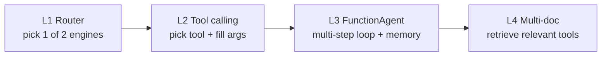

| Stage | What the LLM decides | Memory / multi-step |
|-------|----------------------|---------------------|
| L1 | *Which engine?* (summary vs vector) | Single-shot |
| L2 | *Which tool?* + *what args?* | Still one `predict_and_call` |
| L3 | Plan → call → observe → continue | `Context` + multi-turn `agent.run` |
| L4 | Which paper tools? (via `ObjectIndex`) | Same agent, scaled toolset |

### Week 3 architecture (show this diagram)

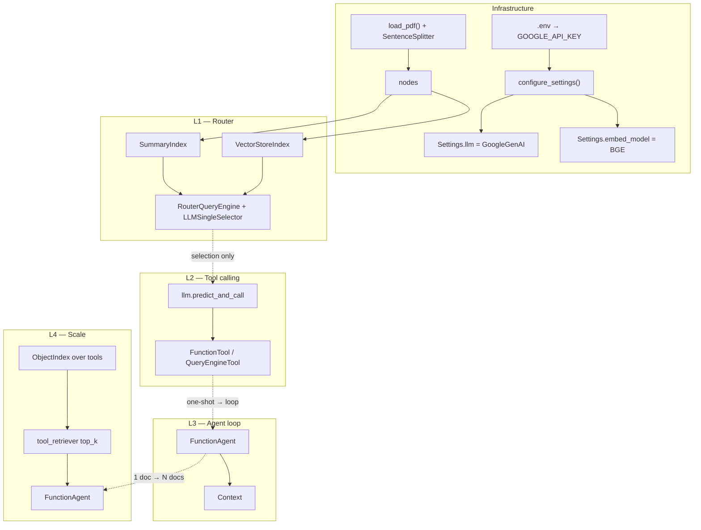

**Teaching point:** each lesson keeps the previous capability and adds one decision the LLM must make.

---

## 2. Shared infrastructure

**Files:** `helper.py`, `utils.py`, `requirements.txt`  
**Theme:** "Configure once, reuse in every notebook."

### 2.1 Opening (say this)

> "Before we talk agents, look at `helper.py`. Every notebook needs three things: an API key, an LLM, and embeddings. We also force PDF text extraction — if you load a PDF as raw binary text, you get thousands of junk chunks and your rate limit dies on the first `tree_summarize`."

### 2.2 Helper API map (show this diagram)

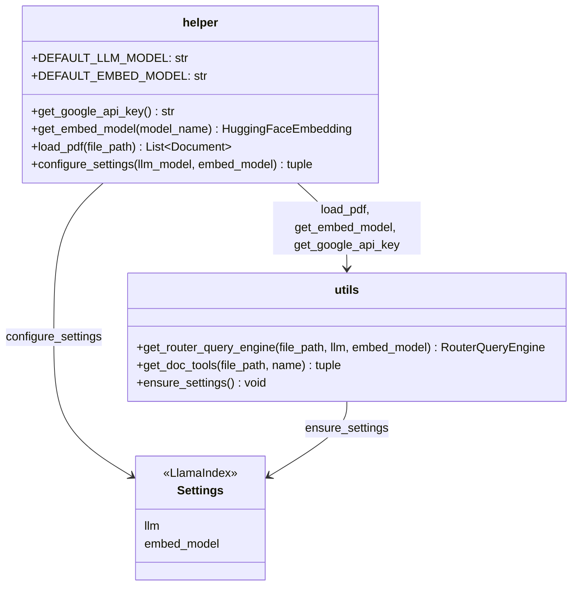

### 2.3 Function linkage

| Function | Calls | Returns / side effect |
|----------|-------|------------------------|
| `get_google_api_key()` | `os.getenv` | API key or raises |
| `get_embed_model()` | `HuggingFaceEmbedding(...)` | Local embedder (no quota) |
| `load_pdf(path)` | `SimpleDirectoryReader` + `PDFReader` | List of `Document`s |
| `configure_settings()` | above + `GoogleGenAI` | Sets global `Settings` |
| `get_router_query_engine(path)` | load → split → indexes → tools → router | `RouterQueryEngine` |
| `get_doc_tools(path, name)` | load → split → `vector_tool_{name}` + `summary_tool_{name}` | Tool pair for L3/L4 |

### 2.4 Why local embeddings?

> "Gemini has RPM limits. Embeddings run on every chunk at index time and on every query. Local `bge-small-en-v1.5` keeps indexing free and predictable. First run downloads ~33MB — warn students."

### 2.5 Ops checklist (say before demos)

1. `GOOGLE_API_KEY` in `.env`
2. `pip install -r requirements.txt`
3. `metagpt.pdf` in `week_3/` (or curl from OpenReview)
4. `nest_asyncio.apply()` in notebooks (needed for nested async in Jupyter)

---

## 3. Lesson 1 — Router Engine

**Notebook:** `L1_Router_Engine.ipynb`  
**Theme:** "Same data, two strategies — let the LLM pick."

### 3.1 Opening (say this)

> "A summary question and a mechanism question should not hit the same retrieval path. Summarization needs the whole document. Specific Q&A needs semantic top-k. Lesson 1 builds both engines over the **same nodes**, wraps them as tools with descriptions, and lets `RouterQueryEngine` choose exactly one."

### 3.2 Pipeline walkthrough (show this diagram)

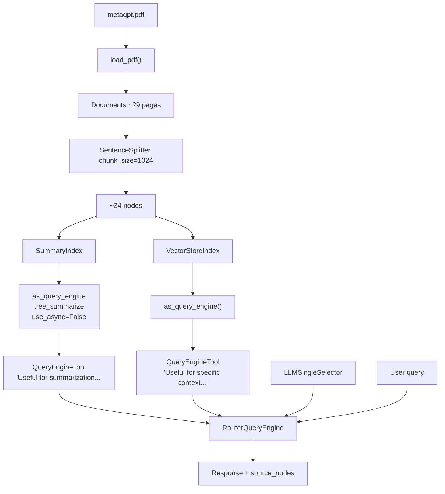

### 3.3 Class / API linkage

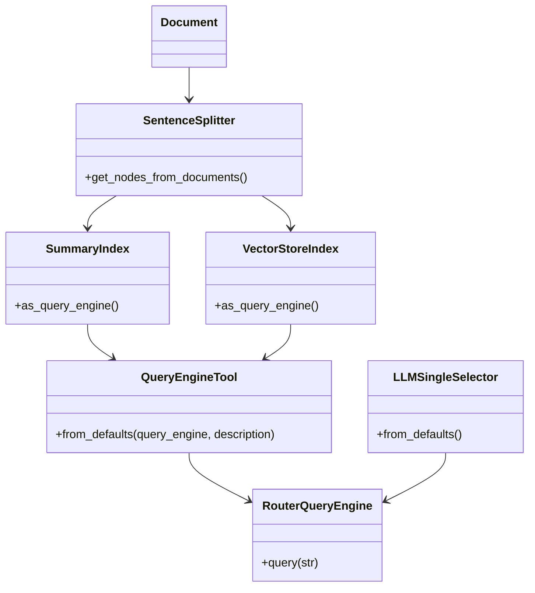

### 3.4 Live demo talking points

Build step-by-step in the notebook, then show the one-liner wrapper:

```python
from utils import get_router_query_engine

query_engine = get_router_query_engine("metagpt.pdf")
response = query_engine.query("What is the summary of the document?")
```

**Demo sequence (do in order):**

| Query | Expected router choice | What to point at |
|-------|------------------------|------------------|
| `"What is the summary of the document?"` | Engine 0 — summary | `len(response.source_nodes)` ≈ all nodes |
| `"How do agents share information with other agents?"` | Engine 1 — vector | Shared message pool / pub-sub answer |
| `"Tell me about the ablation study results?"` | Engine 1 — vector | Specific context, not whole-doc summary |

### 3.5 Teaching beats

1. **Same nodes, two indexes** — indexes are different *access patterns*, not different data.
2. **Router = lightweight agent** — it reads tool *descriptions* and picks one (`LLMSingleSelector` = exactly one).
3. **Description quality matters** — vague descriptions → wrong routing.
4. **`use_async=False`** — `tree_summarize` can fan out many LLM calls; disable async to protect low RPM quotas.
5. **PDFReader is mandatory** — contrast with "what goes wrong if you skip it."

### 3.6 Transition to L2

> "The router only answers: *which engine?* It cannot answer: *search page 2*. For that we need tools that accept arguments."

---

## 4. Lesson 2 — Tool Calling

**Notebook:** `L2_Tool_Calling.ipynb`  
**Theme:** "Not just which tool — *with what arguments.*"

### 4.1 Opening (say this)

> "Function calling is the jump from routing to **parameterized** retrieval. Natural language says 'page 2'; the model fills `page_numbers=['2']`. Docstrings become the API contract the LLM must follow."

### 4.2 Warm-up: simple tools (show this diagram)

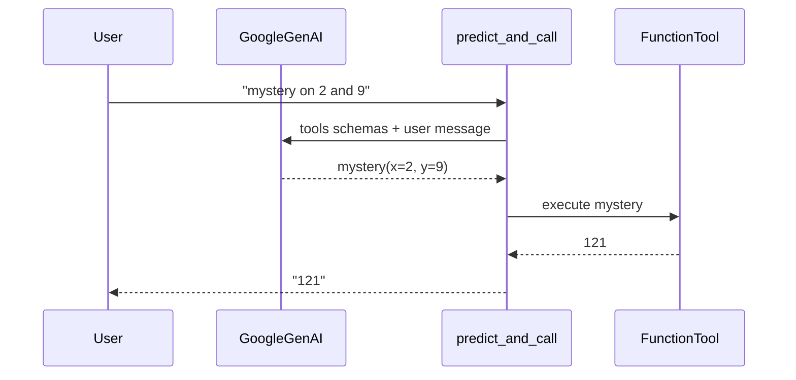

**Live demo:**

```python
def add(x: int, y: int) -> int:
    """Adds two integers together."""
    return x + y

def mystery(x: int, y: int) -> int:
    """Mystery function that takes two integers."""
    return (x + y) * (x + y)

add_tool = FunctionTool.from_defaults(fn=add)
mystery_tool = FunctionTool.from_defaults(fn=mystery)

response = llm.predict_and_call(
    [add_tool, mystery_tool],
    "Tell me the output of the mystery function on 2 and 9",
    verbose=True,
)
```

> "Pause on `verbose=True` — students should see the model choose `mystery` and fill `x` and `y`. That same mechanism later fills page filters."

### 4.3 Manual metadata filter → auto-retrieval tool

First show **manual** filters (you hard-code page 2), then lift that into a **tool** so the LLM chooses the filter:

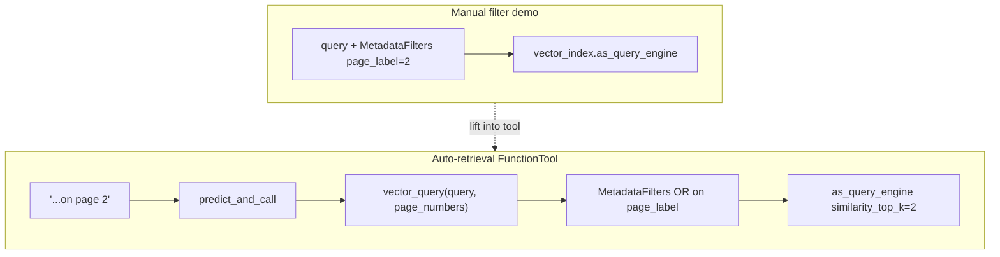

**Core tool pattern:**

```python
def vector_query(query: str, page_numbers: Optional[List[str]] = None) -> str:
    """Answer questions over a paper with optional page filters.
    Always leave page_numbers as None UNLESS there is a specific page...
    """
    # build MetadataFilters from page_numbers → query_engine.query(query)
```

### 4.4 Mixing tool types (show this diagram)

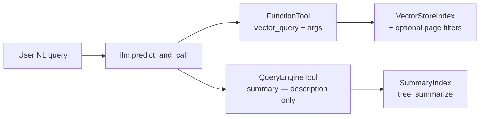

| Tool type | LLM decides | Args? |
|-----------|-------------|-------|
| `FunctionTool` | Whether to call + argument values | Yes (from docstring / type hints) |
| `QueryEngineTool` | Whether to call (from description) | Query string only |

### 4.5 Demo sequence

| Query | Expected behavior |
|-------|-------------------|
| `"What are the high-level results of MetaGPT as described on page 2?"` | `vector_tool` with `page_numbers=["2"]` |
| `"What are the MetaGPT comparisons with ChatDev described on page 8?"` | vector + page filter |
| `"What is a summary of the paper?"` | `summary_tool` |

### 4.6 Teaching beats

1. **Router vs tool calling** — selection vs selection + argument filling.
2. **Docstrings are schemas** — bad docs → bad args.
3. **Metadata filtering** (`page_label`) for page-scoped RAG.
4. **Auto-retrieval** = build the query engine *inside* the tool from LLM-chosen params.

### 4.7 Transition to L3

> "`predict_and_call` is one shot: pick tools, run, done. Real research questions need *multiple* tool calls and follow-ups. That is the agent reasoning loop."

---

## 5. Lesson 3 — Agent Reasoning Loop

**Notebook:** `L3_Building_an_Agent_Reasoning_Loop.ipynb`  
**Theme:** "Think → act → observe → repeat — with memory."

### 5.1 Opening (say this)

> "Ask: *Tell me about the agent roles in MetaGPT, and then how they communicate.* That is two retrieval goals in one sentence. A one-shot tool call often fails; an agent can call `summary_tool` or `vector_tool` more than once, then compose the answer. `Context` stores the conversation so follow-ups like 'results over one of the above datasets' still work."

### 5.2 From utils tools to FunctionAgent (show this diagram)

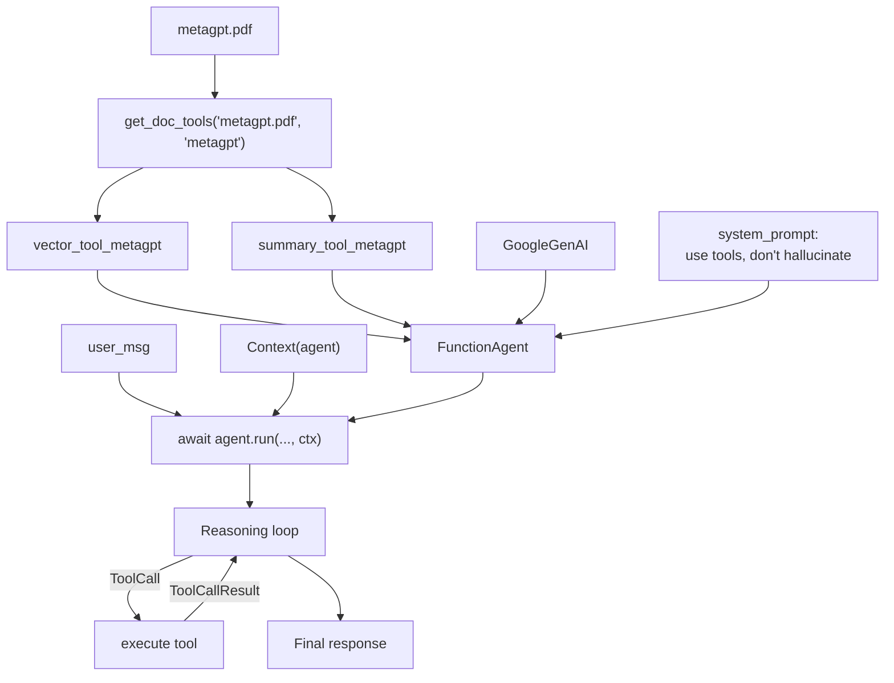

### 5.3 Class / event model (show this diagram)

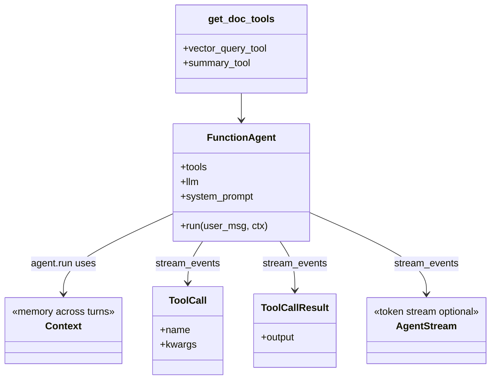

### 5.4 Key code patterns

```python
vector_tool, summary_tool = get_doc_tools("metagpt.pdf", "metagpt")

agent = FunctionAgent(
    tools=[vector_tool, summary_tool],
    llm=llm,
    system_prompt="You are an agent designed to answer queries over a given paper.",
    verbose=True,
)

ctx = Context(agent)
response = await agent.run(
    "Tell me about the agent roles in MetaGPT, and then how they communicate.",
    ctx=ctx,
)
```

**Debuggability — stream events instead of a black box:**

```python
handler = agent.run(user_msg, ctx=ctx)
async for event in handler.stream_events():
    if isinstance(event, ToolCall):
        print(event.tool_name, event.tool_kwargs)
    elif isinstance(event, ToolCallResult):
        print(event.tool_output)
response = await handler
```

### 5.5 Demo sequence

| Turn | Query | What to highlight |
|------|-------|-------------------|
| 1 | Roles + how they communicate | Multiple tool calls in one `run` |
| 2 | `"Tell me about the evaluation datasets used."` | New fact-finding hop |
| 3 | `"Tell me the results over one of the above datasets."` | **Needs `Context`** |
| 4 | Re-run roles query with `stream_events` | Show `ToolCall` / `ToolCallResult` |
| 5 | `"What about how agents share information?"` | Follow-up uses memory |

### 5.6 Teaching beats

1. **Agent vs one-shot** — one query can require several tool calls.
2. **`Context` is not optional** for multi-turn research demos.
3. **System prompt** steers "always use tools / don't invent paper facts."
4. **API migration** — modern path is `FunctionAgent` + workflow events; older `FunctionCallingAgentWorker` / `AgentRunner` are gone — say this explicitly so Stack Overflow answers don't derail students.
5. **Observability** — streaming events is how you debug bad tool choices.

### 5.7 Transition to L4

> "One PDF, two tools — fine. Eleven papers × two tools = twenty-two tools in the prompt every turn. Models get confused. Lesson 4 scales the agent by retrieving *tools* the same way we retrieve *chunks*."

---

## 6. Lesson 4 — Multi-Document Agent

**Notebook:** `L4_Building_a_Multi-Document_Agent.ipynb`  
**Theme:** "Many corpora, then tool retrieval so the agent only sees what matters."

### 6.1 Opening (say this)

> "We keep the same `FunctionAgent` pattern. First we attach tools for three papers — six tools, still manageable. Then we jump to eleven ICLR papers — twenty-two tools. Instead of stuffing all tools into every call, we embed tool metadata in an `ObjectIndex` and retrieve top-k tools per query."

### 6.2 Per-document tool factory (show this diagram)

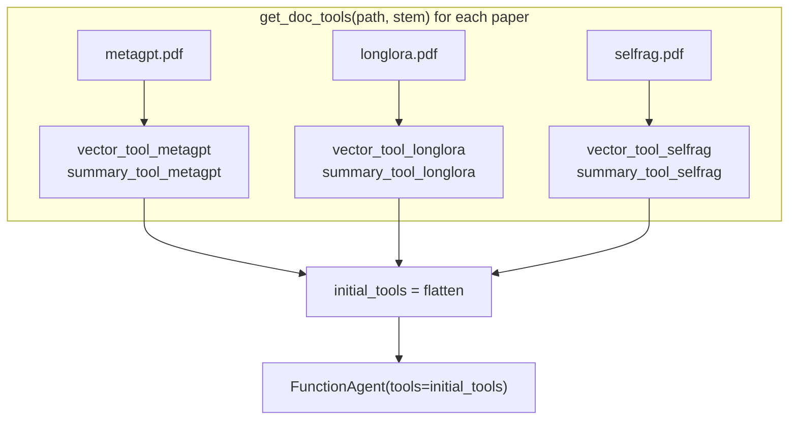

**Pattern:**

```python
paper_to_tools_dict = {}
for paper in papers:
    name = Path(paper).stem
    vector_tool, summary_tool = get_doc_tools(paper, name)
    paper_to_tools_dict[name] = [vector_tool, summary_tool]

initial_tools = [t for tools in paper_to_tools_dict.values() for t in tools]
agent = FunctionAgent(tools=initial_tools, llm=llm, system_prompt=..., verbose=True)
```

### 6.3 Scaling problem → ObjectIndex (show this diagram)

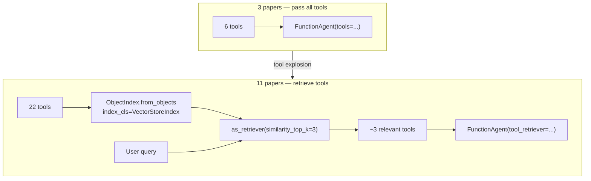

### 6.4 Class linkage for tool retrieval

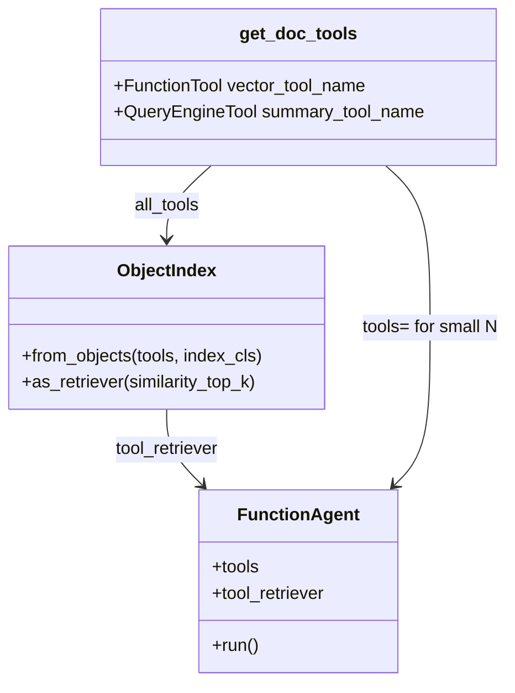

**Key APIs:**

```python
obj_index = ObjectIndex.from_objects(all_tools, index_cls=VectorStoreIndex)
obj_retriever = obj_index.as_retriever(similarity_top_k=3)

# Inspect what would be retrieved:
tools = obj_retriever.retrieve("Tell me about the eval dataset used in MetaGPT and SWE-Bench")

agent = FunctionAgent(
    tool_retriever=obj_retriever,  # not tools=all_tools
    llm=llm,
    system_prompt=...,
    verbose=True,
)
```

### 6.5 Demo sequence

**3-paper agent:**

| Query | Skill shown |
|-------|-------------|
| Evaluation dataset + results for LongLoRA | Multi-hop on one paper among many |
| `"Give me a summary of both Self-RAG and LongLoRA"` | Cross-paper, two summary tools |

**Tool retrieval + 11-paper agent:**

| Query | Skill shown |
|-------|-------------|
| MetaGPT vs SWE-Bench eval datasets | Retriever surfaces the right paper tools |
| Compare LongLoRA vs LoftQ | Cross-paper compare/contrast |

### 6.6 Teaching beats

1. **Namespace tools by stem** — `vector_tool_metagpt` vs `vector_tool_longlora` so the agent can address a paper by name.
2. **Tool explosion is a context problem** — same lesson as RAG chunk overload, applied to tools.
3. **ObjectIndex** embeds tool descriptions; retrieval is semantic over *capabilities*, not paper text.
4. **Compare/contrast** is the payoff: multi-tool, multi-hop, multi-doc in one agent.

### 6.7 Closing the week (say this)

> "You now have a ladder: **route engines → call tools with args → loop with memory → retrieve tools at scale.** That is agentic RAG. Naive top-k is still useful — it is just one tool among many, chosen when the question needs it."

---

## 7. Instructor cheat sheet

### Full stack map (show near end or as handout)

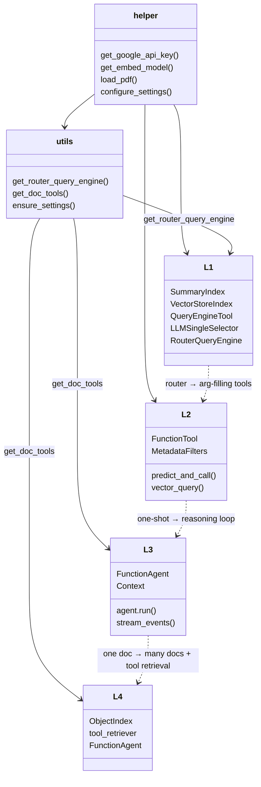

### Decision guide for students

| If the question is… | Prefer |
|---------------------|--------|
| "Summarize the paper" | Summary index / `summary_tool` |
| "How does X work?" | Vector index / `vector_tool` |
| "…on page 2" | `vector_query` + `page_numbers` |
| Multi-part / follow-up | `FunctionAgent` + `Context` |
| Many documents, many tools | `ObjectIndex` tool retriever |

### Timing suggestion (90-minute block)

| Minutes | Segment |
|---------|---------|
| 0–10 | Arc + helper/utils + why not naive RAG |
| 10–30 | L1 live build + three router queries |
| 30–50 | L2 mystery tool → page filter → mixed tools |
| 50–70 | L3 agent + Context follow-up + stream events |
| 70–85 | L4 three papers → ObjectIndex idea (full 11-paper optional) |
| 85–90 | Cheat sheet + Q&A |

### Common failure modes

| Symptom | Likely cause | Fix to mention |
|---------|--------------|----------------|
| Thousands of chunks / rate limit | PDF loaded as text | Use `load_pdf` / `PDFReader` |
| Summary hangs or bursts API | Parallel tree summarize | `use_async=False` |
| Wrong engine chosen | Weak tool descriptions | Rewrite descriptions |
| Wrong or missing page filter | Weak docstring | Document when to leave `page_numbers=None` |
| Follow-up ignores prior answer | New `Context` each time | Reuse same `ctx` |
| Agent ignores relevant paper | Too many tools in prompt | Use `tool_retriever` |
| Import / Settings None | Forgot configure | Call `configure_settings()` or `ensure_settings()` |

### File inventory

| Path | Role |
|------|------|
| `L1_Router_Engine.ipynb` | Router over summary + vector |
| `L2_Tool_Calling.ipynb` | Function calling + auto-retrieval |
| `L3_Building_an_Agent_Reasoning_Loop.ipynb` | FunctionAgent reasoning loop |
| `L4_Building_a_Multi-Document_Agent.ipynb` | Multi-doc + ObjectIndex |
| `helper.py` | API key, Settings, PDF load, embeds |
| `utils.py` | Router factory + `get_doc_tools` |
| `metagpt.pdf` | Primary teaching PDF |
| `requirements.txt` | Dependencies |

---

*End of instructor script.*
