# Week 4 Lecture Script — Building & Evaluating Advanced RAG

> **How to use this file:** Speak from the narrative sections. Pause on each Mermaid diagram and walk the arrows left-to-right (or top-to-bottom). Timing cue: ~90–110 minutes total, or split into four ~25-minute sessions (one per lesson).

---

## Course Arc (2 min)

This week we answer one question: **how do you improve a RAG system in a principled way?**

We do not guess. We:

1. Build a **baseline** RAG pipeline (L1)
2. Measure it with the **RAG triad** (L2)
3. Upgrade retrieval with **sentence windows** (L3)
4. Upgrade retrieval again with **auto-merging** (L4)
5. Compare versions on the same eval set until metrics — and cost — look right

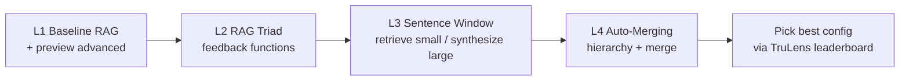

**Shared corpus across lessons:** Andrew Ng’s *How to Build a Career in AI* PDF. Encourage students to swap in their own PDF later — the pipeline stays the same.

**Shared stack:** LlamaIndex (index + query engine) · HuggingFace `bge-small-en-v1.5` (embeddings) · OpenAI GPT-3.5-Turbo (generation + eval LLM) · TruLens (instrumentation + RAG triad).

---

# Lesson 1 — Advanced RAG Pipeline (Overview)

## Teaching goal

Students leave able to draw the three-stage RAG loop, run a baseline query engine, and explain *why* we need evaluation before we “improve” anything.

## Opening: What is RAG? (5 min)

A RAG pipeline has three phases:

| Phase | Job |
|---|---|
| **Ingestion** | Load → chunk → embed → store in an index |
| **Retrieval** | Map a user query to top-K similar chunks |
| **Synthesis** | Stuff query + chunks into the LLM prompt → answer |

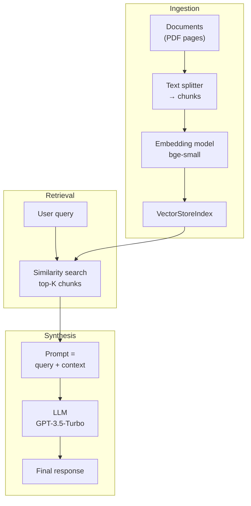

**Say this out loud:** “Same text chunk is used for both embedding *and* synthesis in the naive pipeline. That tension — small chunks retrieve well, large chunks synthesize well — is exactly what L3 and L4 fix.”

## Notebook walkthrough — Baseline (8 min)

1. Load PDF → list of `Document` objects (one per page, ~41 pages).
2. **Merge into a single `Document`.** Why? Advanced retrievers (sentence window, auto-merge) need contiguous text so neighboring chunks blend cleanly.
3. Build `VectorStoreIndex.from_documents(...)` — under the hood: chunk, embed, index.
4. `index.as_query_engine()` → run a smoke-test question, e.g. *“What are steps to take when finding projects to build your experience?”*

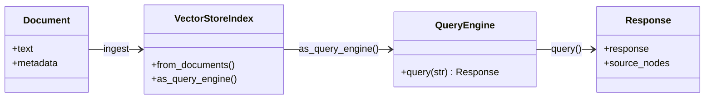

## Why evaluate before “advanced”? (5 min)

Surface-level answers can look good and still be wrong. We introduce the **RAG triad** early (deep dive in L2):

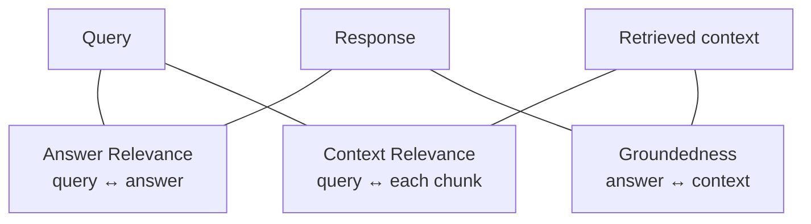

| Metric | Question it answers | Failure mode it catches |
|---|---|---|
| Answer relevance | Did we answer the question asked? | Off-topic / partial answers |
| Context relevance | Did retrieval fetch the right stuff? | Bad chunking / wrong top-K |
| Groundedness | Is the answer *supported* by context? | Hallucination from pretraining |

**Demo beat:** Run TruLens recorder on ~10 eval questions. Typical first-pass pattern: answer relevance & groundedness look OK; **context relevance is low**. That motivates advanced retrieval.

## Preview of the two upgrades (5 min)

### Sentence window (L3 teaser)

Embed **sentences** (precise retrieval). At answer time, replace each hit with a **window** of surrounding sentences (richer synthesis).

### Auto-merging (L4 teaser)

Store a **hierarchy** of chunk sizes. Retrieve leaf nodes; if enough siblings of one parent are retrieved, **swap children for the parent** → coherent block instead of fragments.

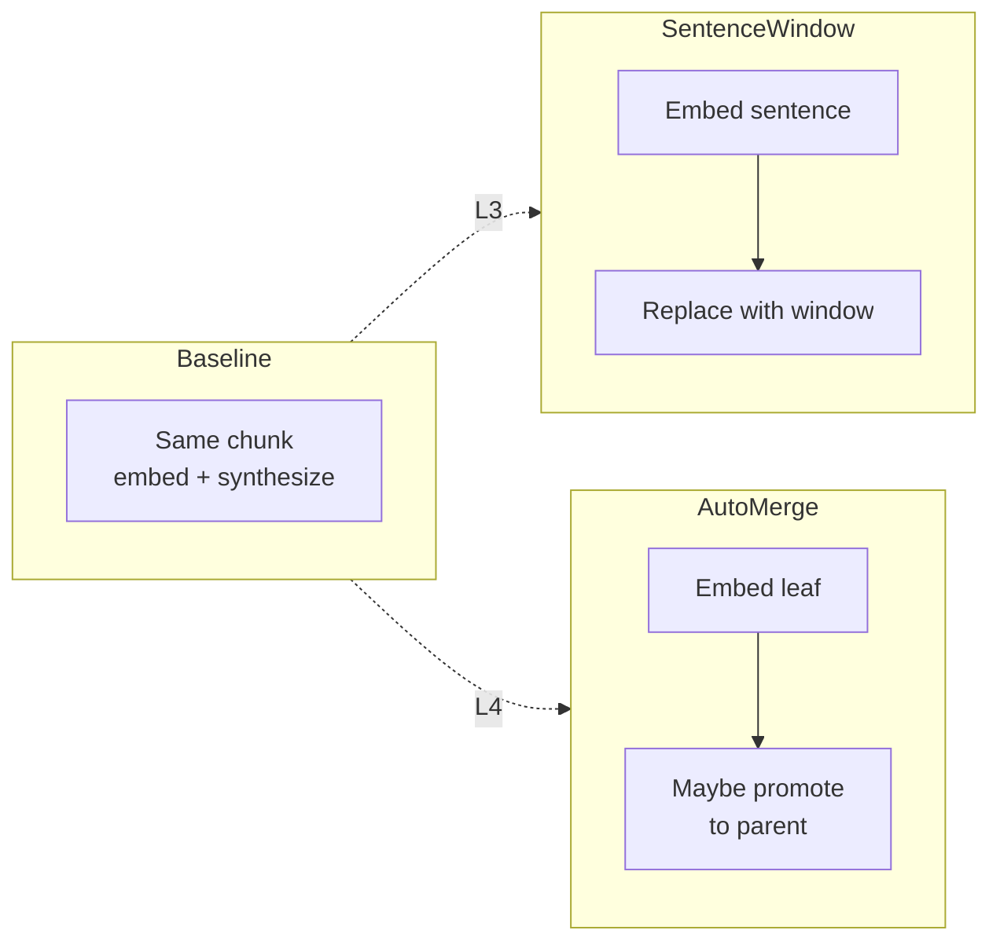

**Close L1:** “You now have a baseline, an eval harness, and two techniques we will unpack. Next lesson: how feedback functions actually score the triad.”

---

# Lesson 2 — The RAG Triad of Metrics

## Teaching goal

Students can implement each feedback function, map it to RAG stages, and use TruLens records + dashboard to debug failure modes.

## Opening: Feedback functions (5 min)

A **feedback function** scores an LLM app on a 0–1 scale by inspecting inputs, outputs, and intermediate results. Providers can be LLMs (what we use), BERT-style models, or classic NLP metrics (ROUGE/BLEU — syntactic, less semantic).

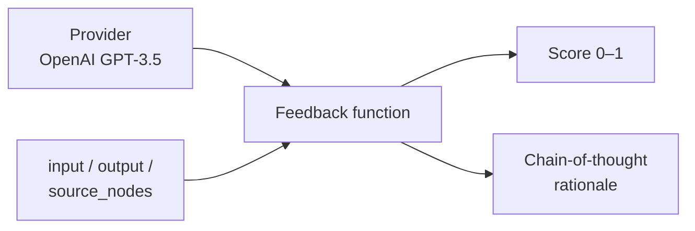

## Mapping triad → RAG stages (3 min)

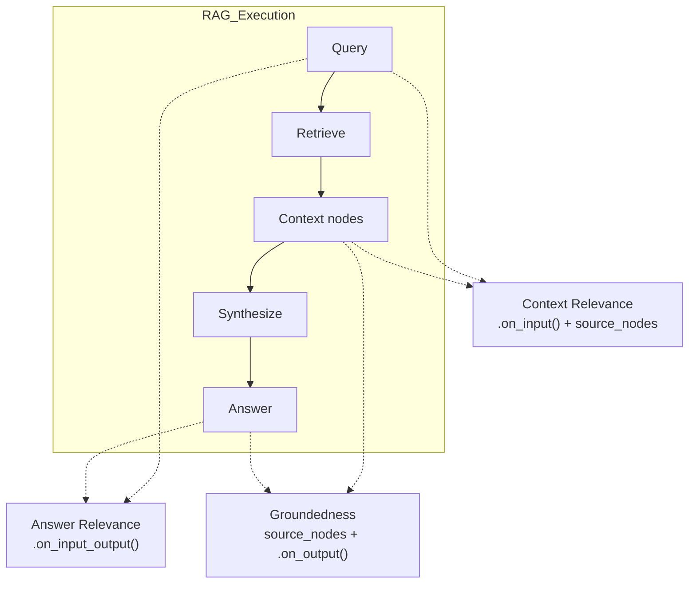

Walk each arrow:

1. **Answer relevance** — only needs query + final answer. Does not look at retrieval.
2. **Context relevance** — scores *each* retrieved node vs query, then `aggregate(mean)`.
3. **Groundedness** — breaks the answer into statements; each statement must be supported by retrieved text; aggregate.

## Code model — how `utils` wires TruLens (7 min)

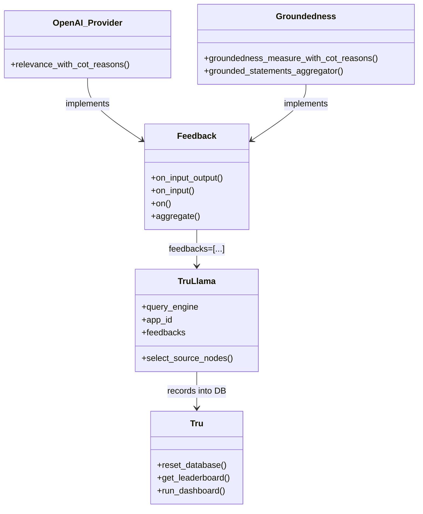

**Function linkage (speak while pointing at the board):**

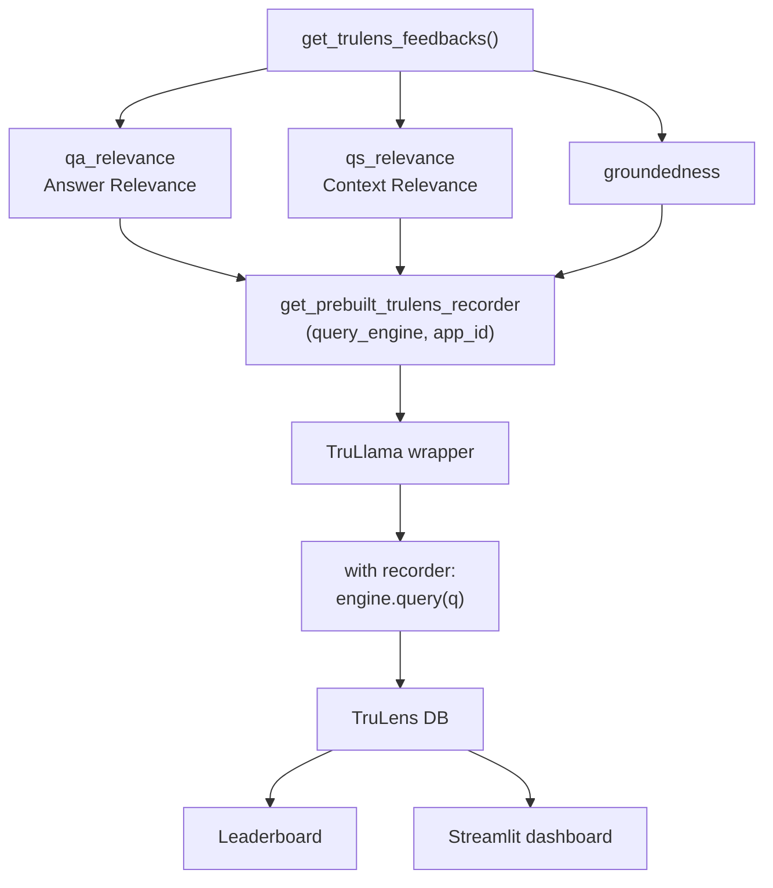

Concrete wiring from the helpers:

- Answer Relevance → `Feedback(...).on_input_output()`
- Context Relevance → `.on_input().on(TruLlama.select_source_nodes().node.text).aggregate(np.mean)`
- Groundedness → `.on(source_nodes).on_output().aggregate(grounded_statements_aggregator)`

## Live debugging story (8 min)

Use one good record and one bad record from the dashboard.

**Good record pattern:** High answer relevance + high context scores per node + every answer sentence cites supporting evidence.

**Bad record pattern (classic hallucination):** Question about altruism & career. Answer sounds plausible (“personal fulfillment…”) but **no supporting evidence in retrieved context** → groundedness collapses. Context relevance may also be mediocre.

**Teaching punchline:** Low context relevance often *causes* low groundedness — the LLM fills gaps from pretraining. Fix retrieval (L3/L4), don’t just prompt-engineer the synthesizer.

## Eval set (2 min)

Load `eval_questions.txt`. Show students how to append custom questions. Same set will be reused so leaderboards are comparable across app IDs (`app_1`, `sentence_window`, …).

**Close L2:** “You can now measure. Next we change *how* we retrieve.”

---

# Lesson 3 — Sentence Window Retrieval

## Teaching goal

Students can explain the retrieve-small / synthesize-large tradeoff, build the sentence-window index + query engine from components, and tune `window_size` with TruLens.

## The problem (4 min)

Naive RAG uses **one chunk size** for both embedding and synthesis:

- Too small → precise match, but LLM lacks context → weak groundedness
- Too large → fuzzy embeddings, noisy retrieval → weak context relevance

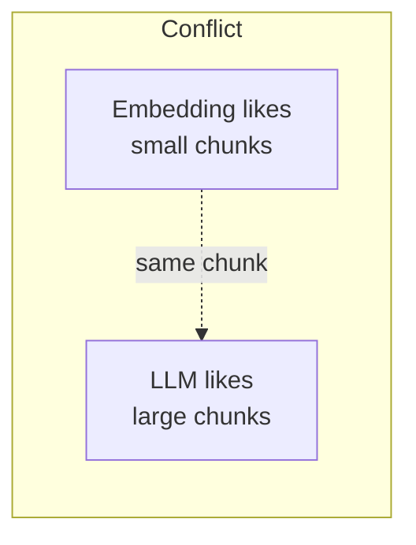

## The idea (3 min)

1. **Index time:** Parse into sentences. Store each sentence’s text for embedding. Store a **window** of neighboring sentences in metadata.
2. **Query time:** Retrieve by sentence similarity. **Replace** node text with the metadata window before synthesis. Optionally **re-rank**.

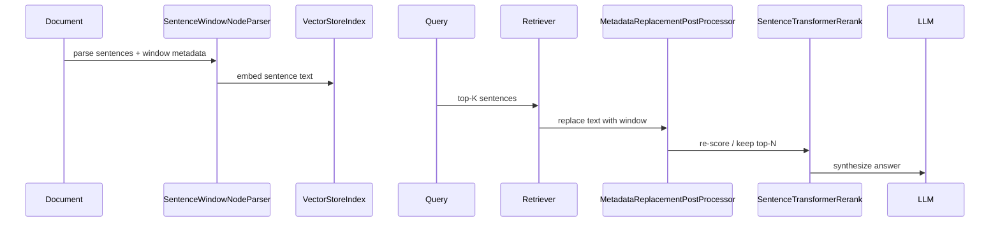

## Component deep-dive (12 min)

### 1. `SentenceWindowNodeParser`

Toy example: three sentences → three nodes. Node text = one sentence. Metadata `window` = sentence ± `window_size` neighbors.

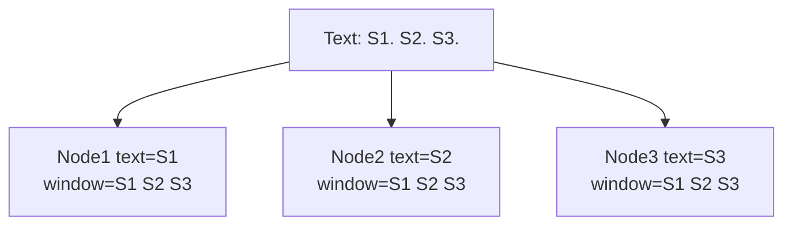

### 2. Index build — `build_sentence_window_index`

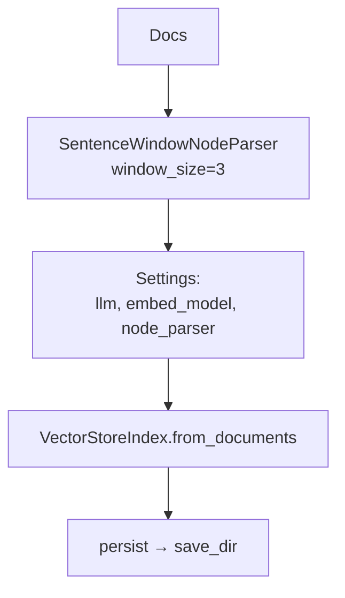

### 3. Query engine — `get_sentence_window_query_engine`

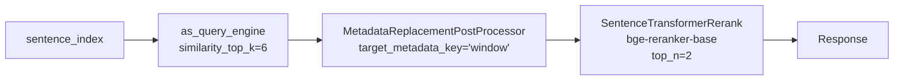

**Class / function map:**

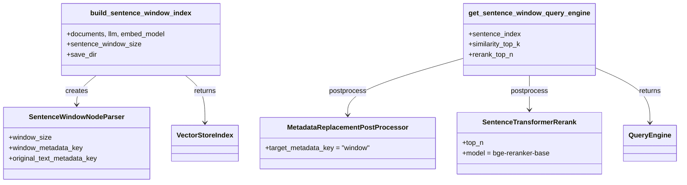

**Re-ranker intuition (30 sec demo):** Query “I want a dog.” Initial vector scores may rank “cat” above “dog.” Re-ranker flips the order — that is why we fetch `top_k=6` then keep `top_n=2`.

## Parameter experiment — window size (10 min)

Run the same eval question(s) with `window_size ∈ {1, 3, 5}` under different TruLens `app_id`s.

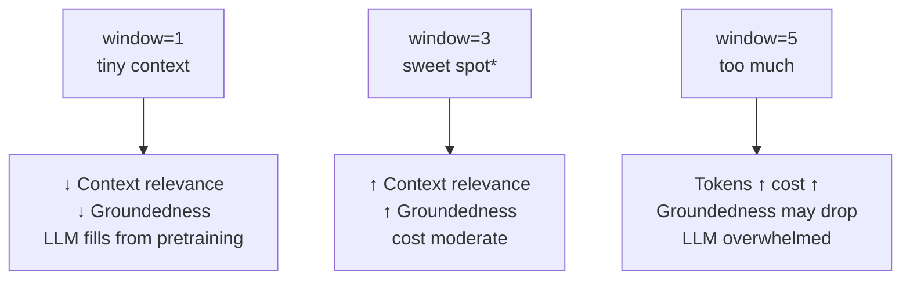

\*Sweet spot is dataset-dependent — in the course notebook, **3** often wins over 1 and 5.

**Causal chain to emphasize:**

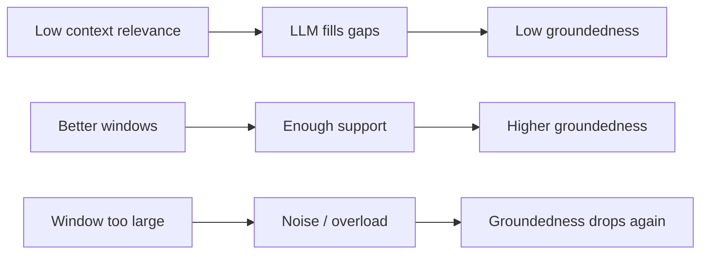

**Close L3:** “Sentence windows fix contiguous local context. What if the relevant pieces are *non-contiguous* siblings under the same section? That is auto-merging.”

---

# Lesson 4 — Auto-Merging Retrieval

## Teaching goal

Students can build a hierarchical node tree, explain leaf-only embedding + docstore parents, implement merge-on-threshold retrieval, and compare 2-layer vs 3-layer hierarchies on the RAG triad.

## The problem (4 min)

Even with good top-K, you may retrieve **fragmented** chunks from the same section — wrong order, missing glue text. Smaller chunks make fragmentation worse.

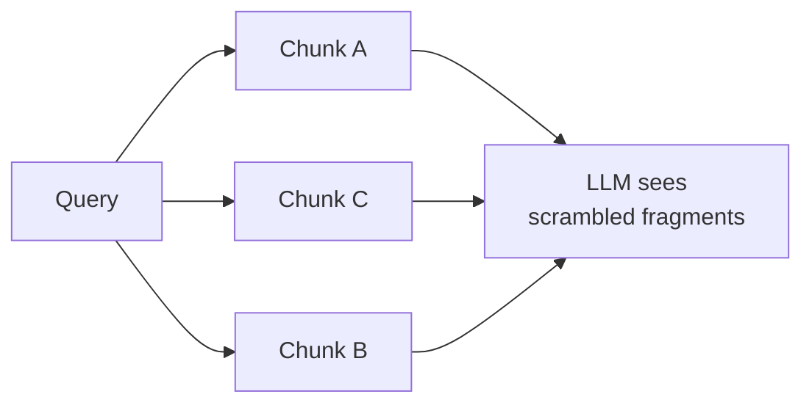

## The idea (4 min)

1. Parse a **hierarchy**: e.g. parent 2048 → children 512 → leaves 128 (factor of 4).
2. **Embed only leaf nodes** in the vector index. Store *all* nodes in the docstore.
3. At retrieval: if a parent’s children exceed a **majority / threshold** among hits, **replace those children with the parent**.

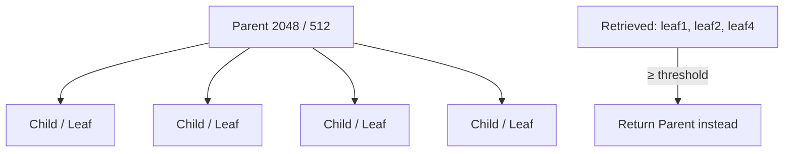

## Component deep-dive (12 min)

### Hierarchical parse

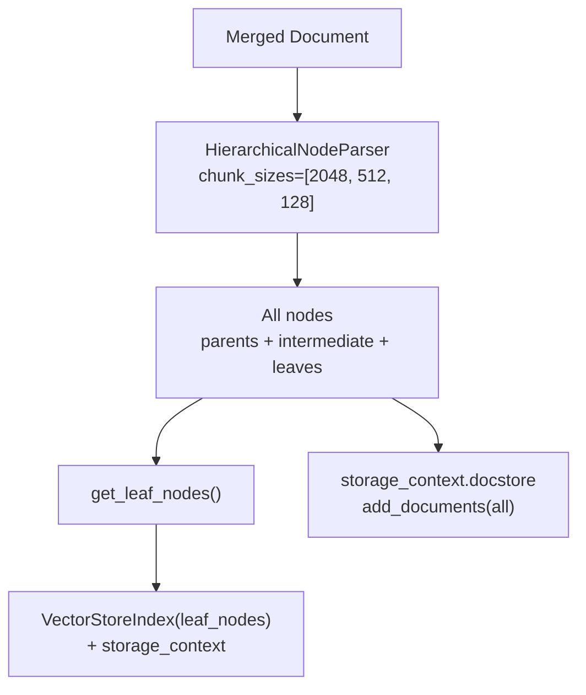

### Query path

```mermaid
sequenceDiagram
  participant Q as Query
  participant BR as base_retriever<br/>leaf top-K
  participant AM as AutoMergingRetriever
  participant DS as DocStore
  participant RR as Reranker
  participant RQE as RetrieverQueryEngine
  participant LLM as LLM

  Q->>BR: similarity_top_k (e.g. 12)
  BR->>AM: leaf hits
  AM->>DS: fetch parents if merge fires
  AM->>RR: merged nodes
  RR->>RQE: top_n (e.g. 6)
  RQE->>LLM: synthesize
```

### Function / class map

```mermaid
classDiagram
  direction TB
  class HierarchicalNodeParser {
    +chunk_sizes
    +get_nodes_from_documents()
  }
  class get_leaf_nodes {
    +nodes → leaf_nodes
  }
  class StorageContext {
    +docstore
  }
  class AutoMergingRetriever {
    +base_retriever
    +storage_context
    +verbose
  }
  class RetrieverQueryEngine {
    +from_args(retriever, postprocessors)
  }
  class build_automerging_index {
    +documents, llm, embed_model
    +chunk_sizes, save_dir
  }
  class get_automerging_query_engine {
    +similarity_top_k
    +rerank_top_n
  }

  build_automerging_index --> HierarchicalNodeParser
  build_automerging_index --> get_leaf_nodes
  build_automerging_index --> StorageContext
  build_automerging_index --> VectorStoreIndex
  get_automerging_query_engine --> AutoMergingRetriever
  get_automerging_query_engine --> SentenceTransformerRerank
  get_automerging_query_engine --> RetrieverQueryEngine
```

**Default knobs from `utils`:** `chunk_sizes=[2048, 512, 128]`, `similarity_top_k=12`, `rerank_top_n=6` (L4) — large leaf recall, then merge, then compress with re-rank.

## Experiment — 2-layer vs 3-layer (8 min)

| App | Hierarchy | Leaf size | Typical observation |
|---|---|---|---|
| App 0 | 2-layer: 2048 ← 512 | 512 | Simpler; context relevance often weaker |
| App 1 | 3-layer: 2048 ← 512 ← 128 | 128 | Better merging granularity; higher context relevance; often **lower cost** (smaller leaves) |

```mermaid
flowchart LR
  subgraph TwoLayer
    P2["2048"] --> L2a["512"]
    P2 --> L2b["512"]
    P2 --> L2c["512"]
    P2 --> L2d["512"]
  end
  subgraph ThreeLayer
    P3["2048"] --> M["512"]
    M --> L3a["128"]
    M --> L3b["128"]
    M --> L3c["128"]
    M --> L3d["128"]
  end
```

Drill one shared hard question (e.g. budgeting for AI projects) in the dashboard: show context relevance and groundedness improving when finer leaves enable better merges.

## Sentence window vs auto-merging (3 min)

They are **complementary**, not rivals:

```mermaid
flowchart TB
  SW["Sentence Window"] -->|"contiguous neighbors<br/>around a hit"| Local["Local expansion"]
  AM2["Auto-Merging"] -->|"siblings under a parent<br/>even if non-adjacent in top-K"| Hier["Hierarchical coherence"]
  Local --> Both["Can combine in production"]
  Hier --> Both
```

**Example:** Leaves 1 and 4 of the same parent are both relevant but not adjacent in the ranked list. Auto-merge can still promote the parent. Sentence window alone would expand each leaf locally and might never glue 1+4 into one block.

**Close L4:** “Advanced retrieval + triad eval + experiment tracking is the loop. Change one hyperparameter, new `app_id`, compare leaderboard, inspect failing records, repeat.”

---

# Week Wrap-Up (5 min)

## Mental model for students

```mermaid
flowchart TB
  subgraph Build
    B["Baseline VectorStoreIndex"]
    SWI["Sentence window index"]
    AMI["Auto-merging index"]
  end
  subgraph Measure
    Triad["RAG Triad feedbacks"]
    Rec2["TruLlama recorder"]
    LB2["Leaderboard + dashboard"]
  end
  subgraph Iterate
    Params["window_size · chunk_sizes · top_k · top_n"]
  end
  Build --> Measure --> Iterate --> Build
```

## Cheat sheet — which failure → which lever

| Symptom | First lever to try |
|---|---|
| Low context relevance, answers thin | Sentence window ↑ (carefully) or finer auto-merge leaves |
| Low groundedness, answers “sound smart” | Improve retrieval context (not only the system prompt) |
| High cost / token blow-up | Smaller windows, stronger re-rank `top_n`, fewer layers if quality holds |
| Fragmented same-section chunks | Auto-merging hierarchy |
| Contiguous but incomplete local context | Sentence window |

## What we did *not* cover (optional aside)

TruLens also ships honesty / harmlessness / helpfulness feedbacks beyond the triad. Point students at the open-source catalog for production apps.

## Suggested live demo order

1. Baseline query → show answer
2. TruLens triad on 3–5 questions → highlight low context relevance
3. Sentence window `window=1` vs `3` on one failing question
4. Auto-merge 2-layer vs 3-layer leaderboard snapshot
5. End on the complementarity diagram

---

## Appendix — File map for TAs

| Lesson | Notebook | Key helpers in `utils.py` |
|---|---|---|
| L1 | `L1/L1-Advanced_RAG_Pipeline.ipynb` | `get_trulens_feedbacks`, `get_prebuilt_trulens_recorder`, both builders |
| L2 | `L2/L2-RAG_Triad_of_metrics.ipynb` | Feedback construction (often inline), sentence-window engine |
| L3 | `L3/L3-Sentence_window_retrieval.ipynb` | `build_sentence_window_index`, `get_sentence_window_query_engine` |
| L4 | `L4/L4-Auto-merging_Retrieval.ipynb` | `build_automerging_index`, `get_automerging_query_engine` |

Shared data: `eBook-How-to-Build-a-Career-in-AI.pdf`, `eval_questions.txt` / `generated_questions*.text`.
